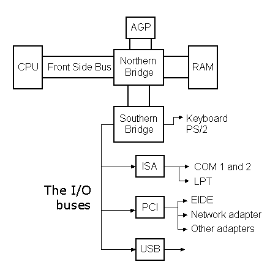
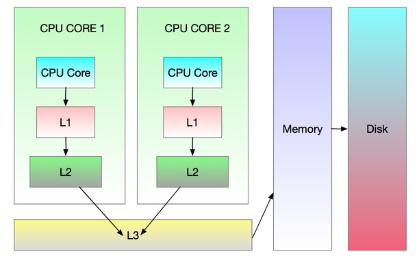

学习的目的是为了更加有效地解决问题。如何在应用程序出现异常时抽丝剥茧、由表及里地分析、定位、解决、验证问题，就是学习《深入理解计算机系统-从程序员视角》一书的意义和目的所在。在学习的全阶段过程中，除了完成书中提供的习题和实验，更要开放思维、举一反三，主动创设各类问题场景，加深、巩固对知识的理解和运用。

## 什么是计算机系统
计算机系统是由**硬件**和**系统软件**组成的，它们共同工作来运行应用程序。

硬件知识主要包括计算机体系结构和计算机组成原理，**计算机体系结构**讲述计算机由哪些逻辑部件组成，这些部件之间的联系及各自承担的功能，冯诺依曼体系结构（运算器、控制器、存储器、输入设备、输出设备）就是一种典型的计算机体系结构；**计算机组成原理**则是针对体系结构的每一类部件，详细叙述采用何种技术予以实现，例如CPU（运算器+控制器）是采用CISC还是RISC，指令集中的每条指令如何通过门电路实现。计算机体系结构和计算机组成原理的关系大致可类比于接口类和实现类。

系统软件即是操作系统。操作系统是集信息处理过程中各种抽象于大成者。应用程序与操作系统、硬件的关系可类比于公民与国家、地球之间的关系。应用程序让渡自己的一部分权利给操作系统（只能执行部分指令集、被强制中断执行等），接受操作系统的管理和调度，用于换取对硬件资源稳定、安全、便捷地使用。

## 为什么1个字节是8个比特
字节是对文本信息的一种编码方案，对于英文文本，A-Za-z0-9加上标点符号，总共6、70个字符，7个比特就足够表示了，因此最开始的ASCII标准1个字节就是7个比特。后来IBM将7个比特扩充为了8个比特，具体原因不详，个人猜测有两个原因，一是具有更好的扩展性，可以补充更多的特殊字符，二是由于8是2的三次方，在总线寻址的电路设计中更加方便。（参见[为什么一个字节定义成8位？](https://www.zhihu.com/question/367812743)）

## 什么是信息
信息论于1948年由美国数学家、工程师香农（Shannon）在《通信的数学理论》一文中奠定基石。由于信息的抽象性和全域性，各个领域的学者分别给出了不同的定义。当前一种比较普遍的描述信息的说法是：信息是认识主体所感受的或所表达的事务运行的状态和运行状态变化的方式，可分为三个基本层次：语法（Syntactic）信息、语义（Semanic）信息和语用（Pragmatic）信息。（参见[信息论基础(第二版)](https://weread.qq.com/web/reader/51932460717d2f795194340)）

单独的一个010101...比特流没有消除任何的不确定性，采用特定的传输线路编码规范解码为字节序列，消除了噪声带来的不确定性。然后基于一定的上下文语境将字节序列进一步拆分为数据结构，语义信息就会自动浮现出来，可被认识主体所感受并指导其对数据进行操作。比如，一个同样的字节序列到底是表示一个整数、浮点数、字符串还是机器指令，取决于它是在IO、磁盘、内存、缓存、寄存器的何种上下文语境中。

## 源代码是如何变为可执行文件的
示例源代码如下所示：
```c
#include <stdio.h>

int main()
{
    printf("hello,world\n");
    return 0;
}
```
1. 预处理阶段
```shell
$ gcc -E hello.c -o hello.i
```
预处理器会递归读取所有依赖的头文件并将内容直接插入到源代码文件中。所以在编码的时候要尽可能少地include头文件，以提高编译速度。

2. 编译阶段
```shell
$ gcc -S hello.i
```
生成的main函数的汇编代码如下所示:
```asm
.LC0:
	.string	"hello,world"
main:
	pushq	%rbp          #保存父函数的栈桢指针
	movq	%rsp, %rbp    #%rbp指向栈的顶部，相当于创建当前函数的栈桢
	movl	$.LC0, %edi
	call	puts
	movl	$0, %eax
	popq	%rbp          #将保存的父函数栈桢指针赋值给%rbp，用于当前函数返回时，恢复父函数的栈桢结构
	ret
```
`%rsp`-栈指针寄存器（stack pointer），通常指向栈顶位置，`push`和`pop`指令会改变%rsp的值，用于栈的伸缩。

`%rbp`-桢指针寄存器（frame pointer），指向栈中当前函数桢的起始位置。（函数栈桢的细节参见[x86-64下函数调用及栈桢原理](https://zhuanlan.zhihu.com/p/27339191)）

3. 汇编阶段
```shell
$ gcc -c hello.s
```
将生成的目标文件hello.o进行反汇编
```shell
$ objdump -S hello.o
0000000000000000 <main>:
   0:   55                      push   %rbp
   1:   48 89 e5                mov    %rsp,%rbp
   4:   bf 00 00 00 00          mov    $0x0,%edi    #汇编代码中的$.LC0变为了0,需要在链接的时候重定位
   9:   e8 00 00 00 00          callq  e <main+0xe> #同上，puts函数需要重定位
   e:   b8 00 00 00 00          mov    $0x0,%eax
  13:   5d                      pop    %rbp
  14:   c3                      retq   

```

4. 链接阶段
```shell
$ gcc hello.o -o hello
```
将生成的可执行文件hello进行反汇编
```
$ objdump -S hello
0000000000401122 <main>:
  401122:       55                      push   %rbp
  401123:       48 89 e5                mov    %rsp,%rbp
  401126:       bf 04 20 40 00          mov    $0x402004,%edi       #指向只读数据段中字符串的地址
  40112b:       e8 00 ff ff ff          callq  401030 <puts@plt>    #这一变动的内容要参考《程序员的自我修养》
  401130:       b8 00 00 00 00          mov    $0x0,%eax
  401135:       5d                      pop    %rbp
  401136:       c3                      retq   
  401137:       66 0f 1f 84 00 00 00    nopw   0x0(%rax,%rax,1)
  40113e:       00 00

$ objdump -s hello
Contents of section .rodata:
 402000 01000200 68656c6c 6f2c776f 726c6400  ....hello,world.
```

## 总线与主板上的南桥、北桥芯片组之间是什么关系
北桥称为图形与内存控制器，负责CPU与内存的数据交换、图形处理、CPU与PCIE数据交换，南桥称为输入/输出控制器负责系统的IO功能，传统的南北桥架构如下图所示：


随着CPU工艺的进步，内存控制器已被集成进CPU，而PCIE控制器则由南桥管理，所以现代主板已没有北桥芯片组。（参见[主板上的南桥和北桥是什么意思？](https://zhuanlan.zhihu.com/p/375804757)和[为什么不把南桥集成进CPU？CPU和南桥芯片中什么资源最珍贵？](https://zhuanlan.zhihu.com/p/47479121)）

此外，P6中图1-4的硬件组成似乎有待商榷。“内存总线”不应该连接于“I/O桥”（南桥）和“主存储器”之间，而是连接于“总线接口”（承担北桥职责）和“主存储器”之间。

## 从键盘敲下一个键，到显示出来，计算机到底做了什么
待填坑

可参考这篇文章-[从键盘按下一个6，到显示出来，计算机发生了什么？](https://www.cnblogs.com/xuanyuan/p/14679727.html)

## 什么是高速缓存
高速缓存存储器（cache memory，简称为cache或高速缓存）是为了缓解高速的数据访问设备与低速的数据提供设备之间的矛盾所引入的一类存储器。为了实现高速访问，硬件上采用静态随机访问存储器（SRAM），其访问速度远远高于内存使用的DRAM，软件上利用了局部性原理，即运行中的代码指令在下一个运行周期有很大的概率仍然会访问其临近区域的指令和数据，因此将成块的指令和数据预加载到高速缓存，减少对慢速存储器的访问。

现代CPU内置了L1、L2、L3三级高速缓存，L1中指令和数据分区存储，L1和L2每个核都有，唯其独享，L3只有一个，所有核共享，架构图如下所示：


在Linux中运行lscpu命令，可查看CPU详情
```
$ lscpu
CPU(s):              12
On-line CPU(s) list: 0-11
Thread(s) per core:  2
Core(s) per socket:  6
Socket(s):           1
Model name:          Intel(R) Core(TM) i7-8700T CPU @ 2.40GHz
Virtualization:      VT-x
L1d cache:           32K
L1i cache:           32K
L2 cache:            256K
L3 cache:            12288K
```
（参见[L1，L2，L3 Cache究竟在哪里？](https://zhuanlan.zhihu.com/p/31422201)和[深度剖析cache对规范代码至关重要](https://zhuanlan.zhihu.com/p/396258822)）

## 为什么进程是操作系统中最重要的概念
进程的定义没有1000种也有800种，个人觉得最精辟的一句定义是“**Process is process**”（参见[进程到底是什么？
](https://www.zhihu.com/question/55185966/answer/1327290370)）。第一个process表示进程，第二个process是过程，即进程的本质是一段生命周期。当你在shell中敲入hello命令并按下回车键，进程在这一刻就诞生了；hello程序在终端中输出“hello,world”后退出，进程就在此刻结束。

首先区分一下作业（job）、任务（task）、进程（process）这三个不同的概念。**作业**是对用户待完成工作的总称，计算机诞生初期的批处理作业阶段，用户将代码写入穿孔卡片（punched card， 参见[一文了解穿孔卡片
](https://zhuanlan.zhihu.com/p/415819018)），由管理员载入计算机中运行，最后返回计算结果。现代操作系统里还能看见作业的影子，如下所示：
```shell
$ sleep 5&
[1] 8275
$ jobs -l
[1]+  8275 运行中               sleep 5 &
$ jobs -l
[1]+  8275 已完成               sleep 5
```
**任务**这一概念，最早源于IBM于1960s开发的OS/360系统，用于描述多道程序的并发交错执行，作业可以分解为多个任务执行。**进程**与任务有千丝万缕的联系，一般认为进程是任务在运行期的实例，任务与进程是一对一的关系，在Linux中进程PCB的结构描述就定义为task_struct(位于/usr/src/linux-headers-${kernel_version}/include/linux/sched.h)。具体的比较可参见[operating system - job, task and process, what&#39;s the difference](https://stackoverflow.com/questions/3073948/job-task-and-process-whats-the-difference)。

粗略地看一下task_struct的内容，就能明白进程在操作系统中的核心地位。应用程序是任务的载体，进程是任务的代理者、组织者和执行者，在CPU时间分片、虚拟内存映射、万物皆文件等操作系统软硬件机制配合下，通过创造资源独占的假象，以上下文环境方式提供应用程序运行所需的所有状态信息，以抽象和简化应用程序对计算资源、存储资源、I/O资源的访问机制和具体细节，更为正确、高效、安全地完成分配的任务。

## 内核是一个进程吗
内核就是一个**可执行文件**。在/boot分区中通常有两个形如vmlinuz和initrd的文件：
```shell
$ ls -al
-rw-r--r--  1 root root 68252222 11月 14 16:18 initrd.img-5.4.50-amd64-desktop
-rw-r--r--  1 root root  9513344 9月  23  2020 vmlinuz-5.4.50-amd64-desktop
```
vmlinuz是可引导、压缩的内核，虽然采用gzip压缩，但由于在文件开头部分嵌入了gzip解压缩代码，所以不能直接用gunzip解包。initrd是“initial ramdisk”的缩写，用于开机引导硬件直至vmlinuz内核能够接管对硬件的引导和管理。
```
$ od -t x1 -A d vmlinuz-5.4.50-amd64-desktop |grep "1f 8b 08"
0018864 8f 1f 8b 08 00 00 00 00 00 02 03 ec fd 79 7c 15
4585776 02 21 f9 5e 21 f4 18 72 1f 8b 08 af 63 6b 58 de
7208128 6f 9a 21 21 87 00 7c 1f 8b 08 c6 9d 24 2b 0c 80
$ dd if=vmlinuz-5.4.50-amd64-desktop bs=1 skip=18865|zcat > vmlinuz
gzip: stdin: decompression OK, trailing garbage ignored
$ file vmlinuz
vmlinuz: ELF 64-bit LSB executable, x86-64, version 1 (SYSV), statically linked, BuildID[sha1]=f1c0c4014ab0f86af907c791e50fa91cb3235853, stripped
```
最后解压出来的vmlinuz文件借助initrd的引导载入内存作为内核运行，创建0号进程和1号进程，由1号进程作为祖先进程派生其它所有的进程。内核遵循无事不理的原则，只有在定时器、系统调用等中断当前进程运行的情况下，由CPU依照中断向量表的设定跳转至内核特定位置的指令开始执行，执行完成后再返回当前进程或切换调度后的进程。（参见[内核是内存中的一个或一组进程么？](https://www.zhihu.com/question/269487854/answer/348179125)）

## 单个多核CPU中多进程能否并行(非并发)执行
待填坑
