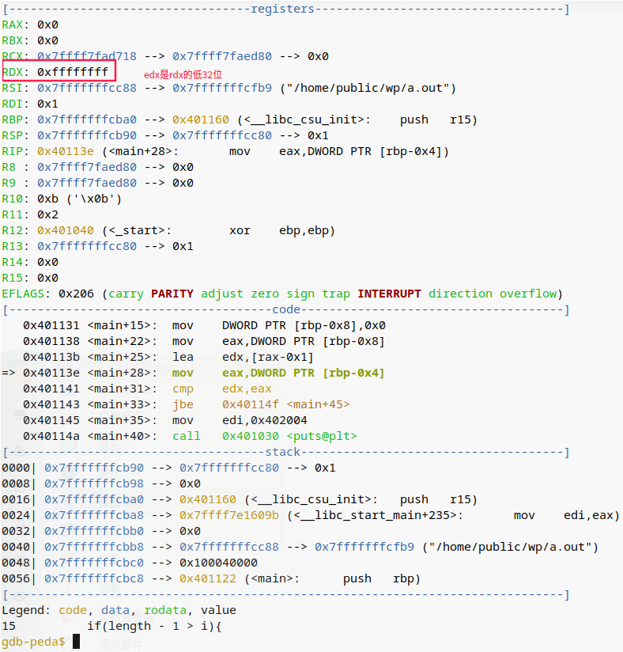

# 1. 什么是编码
美国学者欧廷格曾言：“没有物质什么都不存在，没有能量什么都不发生，没有信息什么都没意义。”

信息是对物质、能量特定状态的客观表达，人类为了描述、交流这些状态必须采取一定的技术手段，这就是编码，编码由**码值**和对码值的**解释**两部分组成。通过编码以及编码之间的逻辑组合，揭示了事物的独特性、规律性、关联性，减弱、消除了自然世界的不确定性，增强了人类的适应性、掌控性。

数字计算机出现之前，人类主要的编码方式就是语言和文字，这是人类在漫长的进化岁月中自发创建出来的，不可避免地具有随意性、模糊性、歧义性、矛盾性。托尔金在《魔戒》中就创造了霍比特语这种全新的语言，即新的编码方式。数字计算机诞生之后，为了能让计算机处理信息，人类将其对信息的编码结果进行二次编码，转换为更适宜于数字电路处理的二值信号，在语言文字编码与数字编码之间仍存在着直观的映射关系。

到了人工智能时代，人类尝试让计算机自行对事物的状态进行编码，其编码格式对人类已不具备了可理解性，脱离了人类的逻辑范畴，这其实是一个危险的信号，因为计算机所理解的意义已不再等同于人类所赋予的意义，也许有一天它会构造自己的逻辑系统。我始终坚信，在浩瀚无垠的宇宙尺度之下，人工智能的确是演化方向上的未来，但并不是人类的未来。

# 2. 为什么会产生溢出
溢出的原因是由于寄存器的位数和个数受限，无法存储超过其位数的数字。Python这样内置虚拟机的解释性语言，没有寄存器的限制，可以处理和存储超大的数值。
```shell
$ python
Python 3.7.3 (default, Aug 26 2020, 21:26:28) 
>>> i=200*300*400*500
>>> i
12000000000
```

# 3. 浮点数为什么是近似表示的
```c
#include <stdio.h>

int main()
{
    float f = 1e20;
    float f1 = (3.14+1e20)-1e20;
    float f2 = 3.14+(1e20-1e20);
    printf("1e20=%f, 1e20=%f\n", 1e20, f);
    printf("(3.14+1e20)-1e20=%f, 3.14+(1e20-1e20)=%f\n", f1, f2);
    return 0;
}

```
```shell
$ gcc -g -o float_test float_test.c
$ ./float_test 
1e20=100000000000000000000.000000, 1e20=100000002004087734272.000000
(3.14+1e20)-1e20=0.000000, 3.14+(1e20-1e20)=3.140000
```
立即数打印是正确的，然而将立即数赋值给变量，其数值就出现了偏差，原因待填坑。

# 4. 什么是地址
计算和处理的比特流按照字节为最小组织单位进行界定和分割，每一个字节占据了特定存储器中的一段空间，由于字节彼此相邻，这些物理空间按照逻辑上的承接关系共同组织为虚拟的线性访问空间。对线性访问空间的每一个存储位置采用数字形式顺序编码，该编码值就成为地址，用于唯一标识每一个字节。

# 5. 如何快速地将2的n次幂转换为二进制和十六进制数
当x等于2的n次幂时，x的二进制表示就是1后面跟n个0，例如2的6次幂就是100,0000B；十六进制0代表4个二进制0,x的十六进制首先将n转换为4的余数形式，即i+4j，然后表示为2的i次幂，后面跟随j个十六进制的0，例如2的9次幂就是0x200

# 6. 什么是字长
字长是CPU在一个时钟周期内能够一次性传输、暂存、处理比特流的最大长度，因此决定字长的是寄存器的长度。P27“字长决定的最重要的系统参数就是虚拟地址空间的最大大小”这一句话并不严谨，指针存储地址，指针位长必然等于地址总线位长，但字长与地址总线位长并没有必然联系（虽然绝大部分情况是相等的），例如16位CPU采用2个寄存器（段寄存器+偏移寄存器）搭配20位的地址总线就可以寻址2的20次方的地址空间。（参见[计算机系统内的字长到底指的是什么？](https://www.zhihu.com/question/20536161/answer/1672310610)）

# 7.如何提升C语言程序的可移植性
ISO C99引入了固定数据大小的数据类型，不随编译器和CPU体系架构而变化，包括int32_t、int64_t等，编译时加上-std=c99开关即可。

# 8. 数据对象在内存中是如何布局的
对于跨越多字节的程序对象，我们必须明确两点：这个对象的地址是什么，以及如何在内存中排列这些字节。在几乎所有机器中，多字节对象都被存储为连续的字节序列，对象的地址为所使用字节中最小的地址。字节序列的排列方式又分为两种：最低有效字节在最低地址的小端排序和最高有效字节在最低地址的大端排序。浏览内存中小端排序的字节序列时，对于数值和地址，书写的自然顺序与计算机显示的顺序正好是相反的。

# 9. 二进制程序的不兼容性是由哪些因素造成的
待填坑

# 10. 除法在汇编语言中是如何实现的
```c
#include <stdio.h>

int main()
{
    unsigned int u_i = 6, u_j;
    int i = 6, j;
    u_j = u_i / 3;
    j = i / 3;
    return 0;
} 
```
其汇编代码如下：
```asm
000000401102 <main>:
  401102:       55                      push   %rbp
  401103:       48 89 e5                mov    %rsp,%rbp
  401106:       c7 45 fc 06 00 00 00    movl   $0x6,-0x4(%rbp)
  40110d:       c7 45 f8 06 00 00 00    movl   $0x6,-0x8(%rbp)
  401114:       8b 45 fc                mov    -0x4(%rbp),%eax
  401117:       ba ab aa aa aa          mov    $0xaaaaaaab,%edx
  40111c:       f7 e2                   mul    %edx
  40111e:       89 d0                   mov    %edx,%eax
  401120:       d1 e8                   shr    %eax                 #逻辑右移
  401122:       89 45 f4                mov    %eax,-0xc(%rbp)
  401125:       8b 4d f8                mov    -0x8(%rbp),%ecx
  401128:       ba 56 55 55 55          mov    $0x55555556,%edx
  40112d:       89 c8                   mov    %ecx,%eax
  40112f:       f7 ea                   imul   %edx
  401131:       89 c8                   mov    %ecx,%eax
  401133:       c1 f8 1f                sar    $0x1f,%eax           #算术右移
  401136:       29 c2                   sub    %eax,%edx
  401138:       89 d0                   mov    %edx,%eax
  40113a:       89 45 f0                mov    %eax,-0x10(%rbp)
  40113d:       b8 00 00 00 00          mov    $0x0,%eax
  401142:       5d                      pop    %rbp
  401143:       c3                      retq   
  401144:       66 2e 0f 1f 84 00 00    nopw   %cs:0x0(%rax,%rax,1)
  40114b:       00 00 00 
  40114e:       66 90                   xchg   %ax,%ax
```
待填坑

# 11. 左移或右移大于字长的位数会发生什么
```c
#include <stdio.h>

int main()
{
    int      lval = 0xFEDCBA98  << 32;
    int      aval = 0xFEDCBA98  >> 36;
    unsigned uval = 0xFEDCBA98u >> 40;

    printf("lval=%x, aval=%x, uval=%x\n", lval, aval, uval);
    return 0;
}
```
```shell
$ gcc shift_oper.c 
shift_oper.c: In function ‘main’:
shift_oper.c:5:33: warning: left shift count >= width of type [-Wshift-count-overflow]
     int      lval = 0xFEDCBA98  << 32;
                                 ^~
shift_oper.c:6:33: warning: right shift count >= width of type [-Wshift-count-overflow]
     int      aval = 0xFEDCBA98  >> 36;
                                 ^~
shift_oper.c:7:33: warning: right shift count >= width of type [-Wshift-count-overflow]
     unsigned uval = 0xFEDCBA98u >> 40;
                                 ^~
$ ./a.out 
lval=0, aval=0, uval=0
```
编译器首先会给出警告信息，移位后的结果均为0(与书中P41结果不移植，说明这是一个未定义行为)

# 12. 什么是C/C++中的未定义行为
巨坑，慎填
（参考[情景剧：C/C++中的未定义行为（undefined behavior）](https://www.cnblogs.com/zpcdbky/p/14853401.html)、[Undefined behavior](https://en.cppreference.com/w/c/language/behavior)、[A Guide to Undefined Behavior in C and C++, Part 1](https://blog.regehr.org/archives/213)）

# 13. 为什么无符号数的比较会溢出
```c
int main()
{
    int i=0;
    unsigned length = 0;
    if(length - 1 > i){
        printf("error\n");
    }
    return 0;
} 
```
其主要汇编指令如下：
```asm
  401126:       48 83 ec 10             sub    $0x10,%rsp
    int i=0;
  40112a:       c7 45 fc 00 00 00 00    movl   $0x0,-0x4(%rbp) #变量i的存放位置
    unsigned length = 0;
  401131:       c7 45 f8 00 00 00 00    movl   $0x0,-0x8(%rbp) #变量length的存放位置
    if(length - 1 > i){
  401138:       8b 45 f8                mov    -0x8(%rbp),%eax #length的值存入%eax
  40113b:       8d 50 ff                lea    -0x1(%rax),%edx #length-1的计算值存入%edx
  40113e:       8b 45 fc                mov    -0x4(%rbp),%eax #i的值存入%eax
  401141:       39 c2                   cmp    %eax,%edx       #i减去length-1
  401143:       76 0a                   jbe    40114f <main+0x2d> #小于等于则跳至函数末尾
        printf("error\n");
  401145:       bf 04 20 40 00          mov    $0x402004,%edi
  40114a:       e8 e1 fe ff ff          callq  401030 <puts@plt>
```
在gdb中单步执行指令`stepi`，地址`40113b`的指令执行后%edx的值为0xffffffff，由于地址`401143`的`jbe`为无符号数跳转指令（判断CF和ZF标志位），因此将0xffffffff作为无符号数进行比较，自然大于0，详见下图：


接下来将length的声明改为int，其汇编指令变动如下：
```asm
  401126:       48 83 ec 10             sub    $0x10,%rsp
    int i=0;
  40112a:       c7 45 fc 00 00 00 00    movl   $0x0,-0x4(%rbp) #变量i的存放位置
    int length = 0;
  401131:       c7 45 f8 00 00 00 00    movl   $0x0,-0x8(%rbp) #变量length的存放位置
    if(length - 1 > i){
  401138:       8b 45 f8                mov    -0x8(%rbp),%eax #length的值存入%eax
  40113b:       83 e8 01                sub    $0x1,%eax       #length-1之后再存入%eax
  40113e:       39 45 fc                cmp    %eax,-0x4(%rbp) #length-1减去i
  401141:       7d 0a                   jge    40114d <main+0x2b> #大于等于则跳至函数末尾
        printf("error\n");
  401143:       bf 04 20 40 00          mov    $0x402004,%edi
  401148:       e8 e3 fe ff ff          callq  401030 <puts@plt>
```
`jge`为有符号数跳转指令，因此将0xffffffff作为有符号数-1进行比较，得到正确结果。

# 其它
1. 数据类型只在高级编程语言和编译器中有效，机器指令和CPU之关注操作数的地址和长度，类型是不可见的。

2. 汇编语言本质上也是一种领域描述语言，其领域为数字计算机的运算。